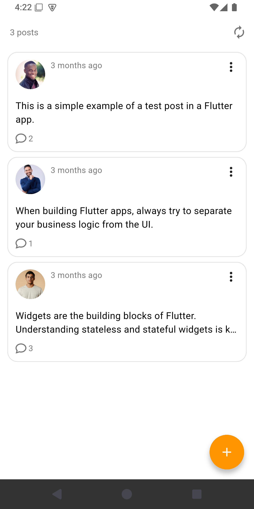
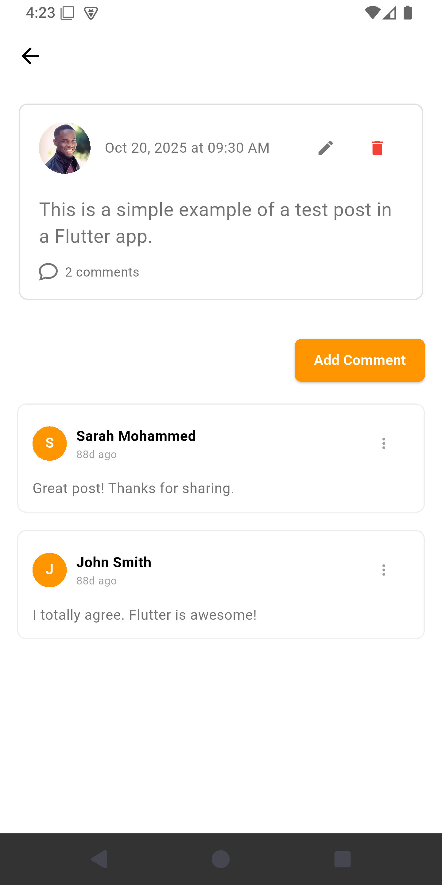
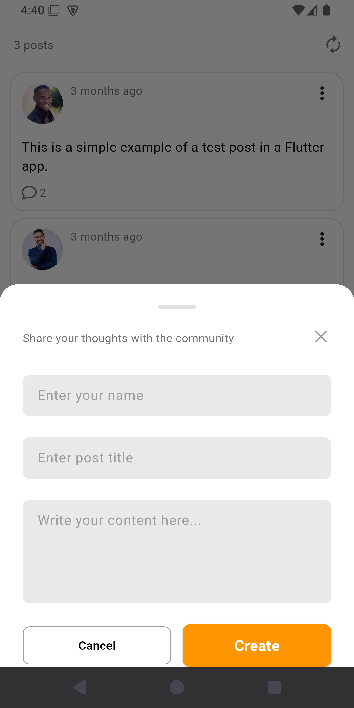
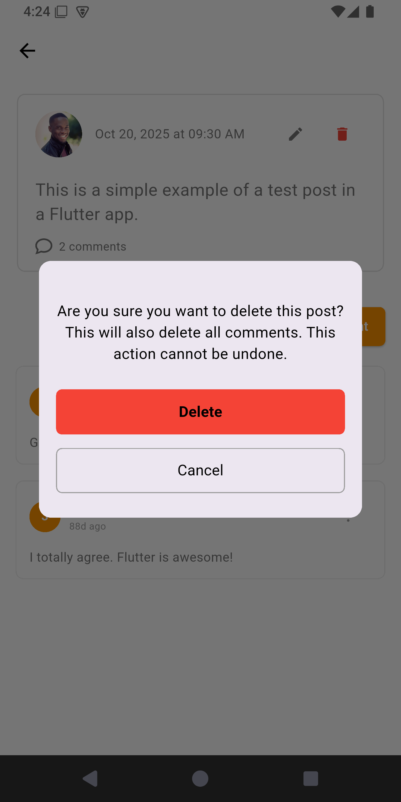
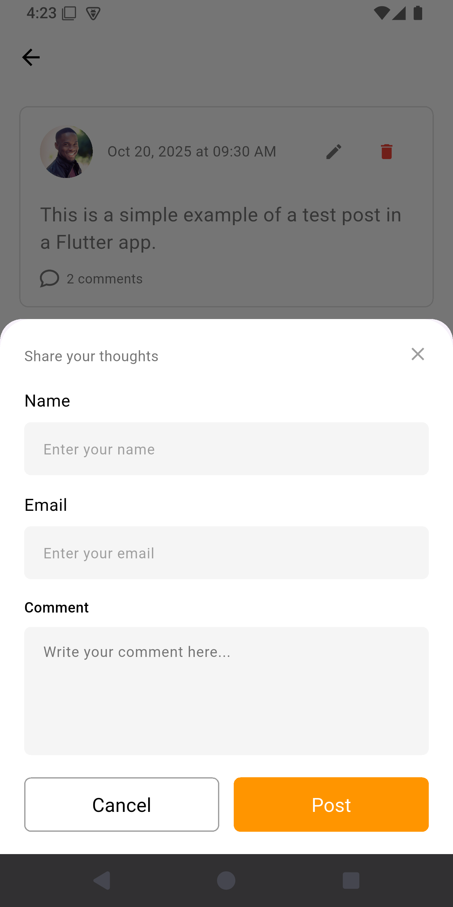

# 📱 Posts App - Flutter Social Media Platform

<div align="center">

A modern and feature-rich Flutter application for creating, viewing, and commenting on posts. Built with clean architecture principles and Provider state management.

</div>

---

## 📱 Screenshots

<div align="center">
  <h3>Main feed</h3>
  
  
  <h3>Post details</h3>
  
  
  <h3>Create post</h3>
   
   <h3>Delete post</h3>
  
  
  <h3>Add comment</h3>
  
</div>

## ✨ Features

<table>
<tr>
<td>

### 📝 Post Management

- ✅ Create new posts
- ✅ Edit existing posts
- ✅ Delete posts with confirmation
- ✅ View all posts in feed

</td>
<td>

### 💬 Comment System

- ✅ Add comments to posts
- ✅ View all comments
- ✅ Comment count display
- ✅ Real-time updates

</td>
<td>

### 🎨 User Experience

- ✅ Modern UI design
- ✅ Bottom sheet forms
- ✅ Smooth animations
- ✅ Error handling

</td>
</tr>
</table>

### 🌟 Key Highlights

- 📱 **Responsive Design** - Works seamlessly on all screen sizes
- 🎨 **Modern UI** - Clean and intuitive user interface
- ⚡ **Real-time Updates** - Changes reflected instantly
- 🔄 **Pull to Refresh** - Manually refresh the posts list
- 🚀 **Bottom Sheet Forms** - Smooth and interactive form sheets
- 🛡️ **Error Handling** - Comprehensive error management
- 🏗️ **Clean Architecture** - Well-organized codebase

---

## 🏗️ Architecture

This project follows **Clean Architecture** principles with clear separation of concerns:

```

lib/
├── core/
│   ├── error_handler/
│   │   ├── api_error_handler.dart      # API error handling
│   │   └── failure.dart                 # Failure model
│   ├── helpers/
│   │   └── spacing.dart                 # Spacing constants
│   ├── di/
│   │   └── dependencies.dart            # Dependency injection
│   ├── routing/
│   │   ├── router.dart                  # Route configuration
│   │   └── app_router.dart              # App router
│   └── theming/
│       ├── colors.dart                  # Color palette
│       ├── font_weight_helper.dart       # Font weights
│       └── styles.dart                  # Text styles
│
├── features/
│   └── posts/
│       ├── data/
│       │   ├── models/
│       │   │   ├── post_model.dart      # Post data model
│       │   │   └── comment_model.dart   # Comment data model
│       │   ├── repositories/
│       │   │   └── posts_repository.dart # Data abstraction
│       │   └── services/
│       │       └── posts_api.dart       # API service
│       │
│       ├── logic/
│       │   └── posts_provider.dart      # State management
│       │
│       └── presentation/
│           ├── screens/
│           │   ├── posts_screen.dart           # Main feed
│           │   └── post_details_screen.dart    # Post details
│           │
│           └── widgets/
│               ├── post_card.dart              # Post card
│               ├── create_post_dialog.dart     # Create/Edit form
│               ├── add_comment_dialog.dart     # Comment form
│               └── delete_post_dialog.dart     # Delete confirmation
│
└── main.dart                            # App entry point
assets/
├── images/
│   └── placeholder.png
└── icons/
    └── comment-icon.png
```

### 📚 Layer Descriptions

| Layer            | Purpose               | Components                           |
| ---------------- | --------------------- | ------------------------------------ |
| **Core**         | Shared functionality  | Error handling, Theming, Routing, DI |
| **Data**         | API & Data Management | Models, APIs, Repositories           |
| **Logic**        | State Management      | Providers, Business Logic            |
| **Presentation** | UI Components         | Screens, Widgets, Dialogs            |

---

## 🚀 Getting Started

### ✅ Prerequisites

- **Flutter SDK** 3.0 or higher
- **Dart SDK** 3.0 or higher
- **IDE**: VS Code, Android Studio, or IntelliJ IDEA

### 📥 Installation

#### 1️⃣ Clone the Repository

```bash
git clone https://github.com/LeenAlkour/posts-app.git
cd posts-app
```

#### 2️⃣ Install Dependencies

```bash
flutter pub get
```

#### 3️⃣ Configure API Base URL

Edit **`lib/main.dart`** and update the base URL:

```dart
final dio = Dio(
  BaseOptions(
    baseUrl: 'https://my-json-server.typicode.com/LeenAlkour/ebtech_task_db',
    connectTimeout: const Duration(seconds: 5),
    receiveTimeout: const Duration(seconds: 3),
  ),
);
```

#### 4️⃣ Run the App

```bash
flutter run
```

---

## 📦 Dependencies

### Production Dependencies

```yaml
dependencies:
  flutter:
    sdk: flutter
  provider: ^6.0.0 # State Management
  dio: ^5.0.0 # HTTP Client
  dartz: ^0.10.0 # Functional Programming (Either)
```

### Development Dependencies

```yaml
dev_dependencies:
  flutter_test:
    sdk: flutter
  flutter_lints: ^2.0.0
```

---

## 🔧 API Configuration

### REST Endpoints

| Method   | Endpoint               | Description       |
| -------- | ---------------------- | ----------------- |
| `GET`    | `/posts`               | Fetch all posts   |
| `POST`   | `/posts`               | Create a new post |
| `DELETE` | `/posts/{id}`          | Delete a post     |
| `POST`   | `/posts/{id}/comments` | Add a comment     |

### 📋 Response Models

#### Post Model

```json
{
  "id": "1",
  "author": "John Doe",
  "title": "Post Title",
  "content": "Post content",
  "image": "image_url",
  "createdAt": "2025-01-15T10:30:00Z",
  "updatedAt": "2025-01-15T10:30:00Z",
  "commentsCount": 5,
  "comments": []
}
```

#### Comment Model

```json
{
  "id": "1",
  "author": "Jane Doe",
  "email": "jane@example.com",
  "content": "Comment content",
  "image": "avatar_url",
  "createdAt": "2025-01-15T10:30:00Z"
}
```

---

## 🎯 Usage Guide

### 📝 Creating a Post

1. Tap the **floating action button** (+ icon) at bottom right
2. Fill in the post details:
   - **Your Name**: Author name
   - **Title**: Post title
   - **Content**: Post body text
3. Tap **"Create"** button
4. New post appears at the top of the list

### ✏️ Editing a Post

1. Navigate to **Post Details** screen
2. Tap the **edit icon** (pencil) at top right
3. Modify the post details
4. Tap **"Update"** button
5. Changes are saved

### 💬 Adding a Comment

1. In **Post Details** screen, tap **"Add Comment"** button
2. Fill in your details:
   - **Name**: Your name
   - **Email**: Your email
   - **Comment**: Your comment text
3. Tap **"Post"** button
4. Comment appears in the comments list

### 🗑️ Deleting a Post

1. In **Post Details** screen, tap the **delete icon** (trash)
2. Confirm deletion in the dialog
3. Post and all comments are removed

---

## 🎨 UI/UX Design

### 🎭 Screens

| Screen           | Purpose   | Features                           |
| ---------------- | --------- | ---------------------------------- |
| **Posts Screen** | Main feed | List of posts, FAB, Refresh button |
| **Post Details** | Post view | Full content, comments, actions    |

### 🧩 Components

| Component            | Type         | Usage                   |
| -------------------- | ------------ | ----------------------- |
| **PostCard**         | Widget       | Individual post display |
| **CreatePostDialog** | Bottom Sheet | Create/Edit posts       |
| **AddCommentDialog** | Bottom Sheet | Add comments            |
| **DeletePostDialog** | Dialog       | Confirm deletion        |

### 🎨 Design Features

- ✅ Bottom Sheet forms for better UX
- ✅ Form validation before submission
- ✅ Success/Error feedback via SnackBars
- ✅ Smooth animations and transitions
- ✅ Drag handle on bottom sheets
- ✅ Auto-adjust for keyboard

---

## 🎨 Theme & Colors

### Color Palette

| Color              | Hex Code  | Usage                        |
| ------------------ | --------- | ---------------------------- |
| **Primary Orange** | `#FF9500` | Buttons, Actions, Highlights |
| **White**          | `#FFFFFF` | Background, Cards            |
| **Black**          | `#000000` | Primary text                 |
| **Gray**           | `#666666` | Secondary text               |
| **Light Gray**     | `#E0E0E0` | Borders, Dividers            |
| **Red**            | `#D32F2F` | Error, Delete actions        |

### Typography

- **Headings**: Font size 18, Weight 600
- **Subheadings**: Font size 16, Weight 600
- **Body Text**: Font size 14, Weight 400
- **Captions**: Font size 12, Weight 400

---

## 🛡️ Error Handling

The app includes comprehensive error handling for various scenarios:

### Error Types

| Error                  | Description           | Handling              |
| ---------------------- | --------------------- | --------------------- |
| **Connection Timeout** | Network unavailable   | Show error message    |
| **Bad Response**       | Invalid HTTP status   | Display server error  |
| **Validation Error**   | Invalid form input    | Show field error      |
| **API Error**          | Server error response | Display error message |
| **Unknown Error**      | Unexpected error      | Show generic message  |

### User Feedback

- All errors displayed via **SnackBars**
- Appropriate error messages
- Action buttons for retry

---

## 📱 Responsive Design

### ✅ Features

- ✅ Works on all screen sizes
- ✅ Optimized for phones and tablets
- ✅ Handles keyboard appearance gracefully
- ✅ Bottom sheets are scrollable
- ✅ Proper spacing and padding
- ✅ Adaptive layouts

---

**Made by [Leen Alkour](https://github.com/LeenAlkour)**

</div>
